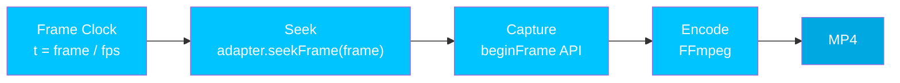

HyperFrames围绕核心保证构建：**相同的[组合](/concepts/compositions) 始终生成相同的视频**。这就是自动化管道、CI 测试和人工智能驱动的工作流程变得可靠的原因。

## 它是如何运作的

渲染管线是逐帧且由搜索驱动的。不涉及实时回放——每一帧都是独立搜索和捕获的。

<Steps>
  <Step title="帧时钟">
    [引擎](/packages/engine) 使用整数数学计算每个帧的时间：`time = floor(frame) / fps`。不存在挂钟依赖性——渲染与实时完全解耦。
  </Step>
  <Step title="寻找">
    [帧适配器](/concepts/frame-adapters) 接收 `seekFrame(frame)` 调用，并确定地将所有动画、DOM 状态和画布内容定位到确切的帧。适配器的 `renderSeek` 暂停所有 [GSAP](/guides/gsap-animation) 时间线并寻找计算时间。
  </Step>
  <Step title="捕获">
    Chrome 的 `HeadlessExperimental.beginFrame` API 捕获当前帧的像素缓冲区。这是一个单一的原子操作——没有部分绘制或竞争条件。
  </Step>
  <Step title="编码">
    FFmpeg 将捕获的帧编码为最终的 MP4 视频。来自 `<audio>` 和 `<video>` 元素的音轨在此阶段混合。
  </Step>
</Steps>



## 是什么让它具有确定性

- **无挂钟依赖性** - 渲染不使用 `Date.now()`、`requestAnimationFrame` 或系统计时器
- **没有未种子的随机性** -- 没有种子的 `Math.random()` 会破坏确定性
- **无渲染时网络获取** - 必须在渲染开始之前加载所有资源
- **固定输出参数** -- `fps`、`width` 和 `height` 在第一帧之前被锁定
- **有限持续时间**——每个[组合](/concepts/compositions)都有一个已知的有限长度

这些相同的规则适用于每个[框架适配器](/concepts/frame-adapters)。如果您正在构建自定义适配器，则必须遵循[确定性契约](/concepts/frame-adapters#determinism-contract)。

## 码头模式

为了获得最大的再现性，请在 Docker 中渲染：

```bash
npx hyperframes render --docker --output output.mp4
```

Docker 模式使用精确的 Chrome 版本和字体集，确保：
- 跨所有平台的相同 Chromium 渲染引擎
- 相同的系统字体（无特定于平台的字体替换）
- 相同的 FFmpeg 编码器版本

有关所有渲染选项，请参阅[渲染指南](/guides/rendering)。

## 预览与渲染奇偶校验

浏览器预览和渲染的 MP4 应匹配。HyperFrames通过以下方式实现这一目标：

- **一个运行时**——相同的 `hyperframe.runtime` 驱动预览和渲染
- **生产者规范行为**——[生产者](/packages/producer) 寻求语义是真相的来源
- **准备门** -- `__playerReady` 和 `__renderReady` 确保在捕获任何帧之前 [composition](/concepts/compositions) 已完全加载

这里的奇偶性意味着**视觉保真度**——每一帧看起来都一样。它*不*意味着性能平等。预览在浏览器中实时播放，因此帧速率限制受您的硬件限制。渲染是搜索驱动的且一次一帧，因此无论每帧成本如何，它都不会丢帧。合成在预览时可能会出现断断续续的情况，但渲染效果却很完美。请参阅[性能](/guides/performance) 了解原因。

<Note>
  由于平台特定的字体渲染和 Chrome 版本，本地渲染（不使用 Docker）可能会出现轻微差异。当精确的再现性很重要时，请使用 Docker 模式。
</Note>

## 对于适配器作者

如果您正在构建[框架适配器](/concepts/frame-adapters)，您的适配器必须遵循确定性契约：

- `seekFrame(frame)` 必须是幂等的——相同的框架，相同的结果
- 没有依赖于调用顺序的副作用（必须处理随机访问）
- “提交”帧后不会解析任何异步操作
- 干净的生命周期：`init` -> `seekFrame`（N次） -> `destroy`

## 下一步

<CardGroup cols={2}>
  <Card title="框架适配器" icon="plug" href="/concepts/frame-adapters">
    构建支持确定性契约的适配器
  </Card>
  <Card title="渲染" icon="film" href="/guides/rendering">
    在本地或 Docker 中渲染为 MP4
  </Card>
  <Card title="@hyperframes/制作人" icon="clapperboard" href="/packages/producer">
    编排确定性输出的完整渲染管道
  </Card>
  <Card title="常见错误" icon="triangle-exclamation" href="/guides/common-mistakes">
    打破决定论的陷阱以及如何避免它们
  </Card>
</CardGroup>
