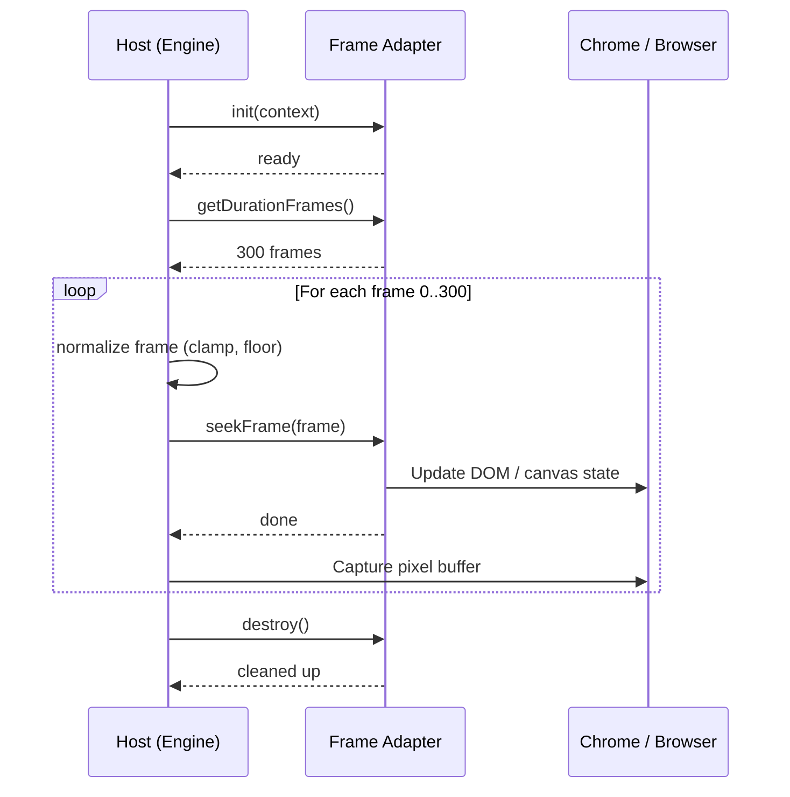

帧适配器模式是HyperFrames支持多个动画运行时的方式。每个适配器都会回答的核心问题：

> N 帧处的屏幕应该是什么样子？

如果运行时可以回答这个问题，它就可以插入HyperFrames中。

<Info>
  适配器 API 目前处于 **v0**（实验性）。在 v1 之前，可能会发生重大更改。核心契约（逐帧查找、确定性输出）是稳定的，但方法签名可能会发生变化。
</Info>

## 它是如何运作的

主机应用程序（[引擎](/packages/engine) 或 [生产者](/packages/producer)）通过严格顺序调用适配器方法来驱动渲染。适配器从不控制自己的时钟——它只响应搜索命令。



## 适配器 API (v0)

```typescript adapters/types.ts
type FrameAdapterContext = {
  compositionId: string;
  fps: number;
  width: number;
  height: number;
  rootElement?: HTMLElement;
};

type FrameAdapter = {
  id: string;
  init?: (ctx: FrameAdapterContext) => Promise<void> | void;
  getDurationFrames: () => number;
  seekFrame: (frame: number) => Promise<void> | void;
  destroy?: () => Promise<void> | void;
};
```

## 所需语义

- `getDurationFrames()` 必须返回一个有限整数 >= 0
- `seekFrame(frame)` 必须支持任意查找顺序（向前、向后、随机）
- `seekFrame(frame)` 对于同一输入帧必须是幂等的
- `seekFrame(frame)` 必须将内部时间限制在适配器的范围内
- 适配器应该是暂停/寻道驱动的，而不是时钟驱动的

## 主机编排

主机在调用适配器之前对帧进行规范化：

```typescript engine/render-loop.ts
normalizedFrame = clamp(Math.floor(frame), 0, durationFrames);
```

一个典型的渲染循环：

```typescript engine/render-loop.ts
await adapter.init?.({ compositionId, fps, width, height, rootElement });
const durationFrames = adapter.getDurationFrames();

for (let frame = 0; frame <= durationFrames; frame += 1) {
  await adapter.seekFrame(frame);
  // capture pixel buffer for this frame
}

await adapter.destroy?.();
```

## 决定论合约

这些规则对于任何适配器都是不可协商的。它们是 Hyperframes [确定性渲染](/concepts/determinism) 保证的基础。

- 规范时钟：`t = frame / fps`
- 无挂钟依赖性（`Date.now`，漂移相关逻辑）
- 没有未种子的随机性
- 无渲染时网络获取
- 固定输出参数（`fps`、`width`、`height`）
- 仅限有限期限
- 寻道前确定性帧量化

## 支持的运行时

第一方运行时适配器：

| 运行时 | 寻找方法 | 技能 |
|---------|-------------|-------|
| [GSAP](/guides/gsap-animation) | `timeline.totalTime(timeSeconds)` 或 `timeline.seek(timeSeconds)` | `/gsap` |
| 动漫.js | `instance.seek(timeMs)` 用于在 `window.__hfAnime` 上注册的动画 | `/animejs` |
| CSS 关键帧 | 浏览器 `Animation.currentTime`，具有暂停的负延迟回退 | `/css-animations` |
| 洛蒂 / 点洛蒂 | `goToAndStop(timeMs, false)`、原始帧设置器或玩家搜索 API | `/lottie` |
| 三.js/WebGL | `hf-seek` 事件加上 `window.__hfThreeTime` 用于确定性场景渲染 | `/three` |
| 网页动画 API | `document.getAnimations()` 和 `animation.currentTime` | `/waapi` |

欢迎社区适配器——如果它可以按帧查找，那么它就属于HyperFrames。

## 一致性测试

每个适配器都应通过以下最低测试：

1. **可重复性**——两次寻找同一帧，得到相同的输出
2. **随机查找** -- 查找顺序 `[90, 10, 50, 10]` 产生确定性结果
3. **边界**——负值和溢出帧值不会破坏
4. **持续时间** -- 返回的持续时间是一个有限整数
5. **清理**——`destroy` 之后没有泄漏的计时器/监听器

## 下一步

<CardGroup cols={2}>
  <Card title="确定性渲染" icon="lock" href="/concepts/determinism">
    了解适配器必须坚持的确定性保证
  </Card>
  <Card title="GSAP动画" icon="wand-magic-sparkles" href="/guides/gsap-animation">
    查看实际使用的第一方 GSAP 适配器
  </Card>
  <Card title="@hyperframes/引擎" icon="gear" href="/packages/engine">
    在渲染期间驱动适配器的捕获引擎
  </Card>
  <Card title="贡献" icon="code-branch" href="/contributing">
    构建并贡献您自己的适配器
  </Card>
</CardGroup>
