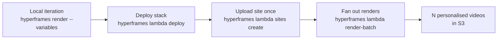

HyperFrames 模板是采用输入变量（名称、颜色、图表负载、CTA URL）的组合，并生成由这些值参数化的最终渲染。将模板与已部署的 Lambda 堆栈和 `lambda render-batch` 配对，您可以通过一次 CLI 调用获得大规模个性化视频：

```bash
hyperframes lambda render-batch ./my-template \
  --batch ./users.jsonl \
  --width 1920 --height 1080
```

本指南将介绍完整的循环：在组合上声明变量，使用 `hyperframes render` 进行本地迭代，部署到 Lambda 一次，然后从批处理文件中扇出 N 个渲染。相同的流程还通过 `lambda render --variables` 驱动单个个性化渲染，并通过 `renderToLambda({ variables })` 驱动程序化批次。



## 什么是模板

模板只是一个 HyperFrames 组合，其顶级 HTML 元素声明一个 `data-composition-variables` 属性，列出它接受的变量。该组合通过 `window.__hyperframes.getVariables()` 读取运行时值。

```html
<!doctype html>
<html
  data-composition-variables='[
    {"id":"title","type":"string","label":"Headline","default":"Welcome"},
    {"id":"accentColor","type":"string","label":"Accent","default":"#0a0a0a"},
    {"id":"avatarUrl","type":"string","label":"Avatar image","default":"/avatars/default.png"}
  ]'
>
<head><meta charset="utf-8"><title>Welcome template</title></head>
<body style="margin:0;background:#f6f5f1">
  <div data-composition-id="root" data-width="1920" data-height="1080" data-duration="5">
    <h1 id="title" style="font:80px Inter,sans-serif">Welcome</h1>
    <div id="accent" style="width:100%;height:8px"></div>
    
  </div>
  <script>
    (function () {
      var v = window.__hyperframes.getVariables();
      document.getElementById("title").textContent = v.title;
      document.getElementById("accent").style.background = v.accentColor;
      document.getElementById("avatar").src = v.avatarUrl;
    })();
  </script>
</body>
</html>
```

运行时助手公开为全局 — `window.__hyperframes.getVariables()` — 而不是可获取的模块。使用普通的 `<script>` （不是 `<script type="module">`），以便在脚本执行时运行时已经初始化。

## 声明变量

`data-composition-variables` 数组中的每一项都描述一个变量。支持的形状：

| 场地 | 必需的 | 例子 |
|-------|----------|---------|
| `id` | 是的 | `"title"` |
| `type` | 是的 | `"string"`、`"number"`、`"color"`、`"boolean"`、`"enum"` |
| `label` | 受到推崇的 | `"Headline"` |
| `default` | 受到推崇的 | `"Welcome"` |

有关每种类型的编辑器小部件和仅限 `"enum"` 的 `options` 字段，请参阅 [变量](/concepts/variables)。

`getVariables()` 返回声明的默认值和任何调用者覆盖的合并结果，因此具有合理默认值的合成在预览模式和生产中呈现不变。渲染时覆盖来自 CLI 上的 `--variables '{...}'` 或 SDK 的 `renderToLambda` 调用上的 `variables` 字段。

变量是类型化原语；对于结构化数据（项目符号列表、嵌套记录），在调用方将其序列化并将其解析回组合内部：

```html
<html data-composition-variables='[
  {"id":"heroJson","type":"string","label":"Hero copy (JSON)","default":"{\"title\":\"Hi\"}"}
]'>
```

运行时不会接受声明 `type: "object"` — 解析器拒绝五种规范类型之外的任何内容，并默默地删除声明，因此 `--strict-variables` 会将每个键标记为未声明。

## 局部迭代循环

快速迭代是模板的全部要点——您不必部署到 Lambda 来查看值的外观。在本地使用 `hyperframes render` 和 `--variables` （或 `--variables-file`）来针对任何负载渲染模板：

```bash
hyperframes render --variables '{"title":"Hello Alice","accentColor":"#ff0000"}' \
  --output renders/alice-preview.mp4
```

传递 `--strict-variables` 会导致类型与 `data-composition-variables` 声明不匹配时失败。如果没有该标志，不匹配将打印为警告并且渲染将继续。

```bash
hyperframes render --variables-file ./alice.json --strict-variables \
  --output renders/alice-preview.mp4
```

## 部署到 Lambda

模板在标准 `hyperframes lambda` 堆栈上呈现 - 没有特殊的仅模板部署。跑步：

```bash
hyperframes lambda deploy
```

每个 AWS 账户/区域一次。 [aws-lambda 部署指南](/deploy/aws-lambda) 涵盖 SAM 堆栈、IAM 策略和 CloudFormation 输出。

当同一模板将生成许多渲染时，请使用 `lambda sites create` 上传项目一次，并在每个后续渲染或批次中引用其内容寻址的 `siteId` ：

```bash
hyperframes lambda sites create ./my-template
# → Site ID: abc1234deadbeef0
```

## 单一个性化渲染

对于一次性渲染，请传递 `--site-id` + 每次渲染 `--variables`。 CLI 从 `siteId` 合成最小站点句柄（无需重新打包）并调用 `renderToLambda`：

```bash
hyperframes lambda render ./my-template \
  --site-id abc1234deadbeef0 \
  --width 1920 --height 1080 \
  --variables '{"title":"Hello Alice","accentColor":"#ff0000"}' \
  --output-key renders/alice.mp4 \
  --wait
```

`--wait` 流式传输进度线，直到渲染完成；如果没有它，CLI 会立即返回，您可以通过 `hyperframes lambda progress <renderId>` 进行轮询。

## 批处理管道（标题）

`lambda render-batch` 是最重要的人体工程学：一个 CLI 调用调度 N 个个性化渲染。创作一个 JSONL 文件，每个收件人包含一个条目：

```jsonl
{"outputKey": "renders/alice.mp4", "variables": {"title": "Hi Alice", "accentColor": "#ff0000"}}
{"outputKey": "renders/bob.mp4",   "variables": {"title": "Hi Bob",   "accentColor": "#00aa00"}}
{"outputKey": "renders/carol.mp4", "variables": {"title": "Hi Carol", "accentColor": "#0000ff"}}
{"outputKey": "renders/dave.mp4",  "variables": {"title": "Hi Dave",  "accentColor": "#ff00aa"}}
{"outputKey": "renders/erin.mp4",  "variables": {"title": "Hi Erin",  "accentColor": "#aa00ff"}}
```

运行批处理：

```bash
hyperframes lambda render-batch ./my-template \
  --batch ./users.jsonl \
  --width 1920 --height 1080 \
  --max-concurrent 5
```

该动词部署站点一次（或使用 `--site-id` 跳过），然后每行调用 `renderToLambda` 。变量在每个 JSONL 条目中内联移动 - `render-batch` 不接受 `--variables-file` 因为每个条目的有效负载就是重点。并发 Step Functions 启动上限为 `--max-concurrent`（默认为 50），因此 10 000 个条目的批处理不会尝试同时生成 10 000 个执行并超出 AWS 账户的并发执行限制。

清单输出为每个输入行提供一行：

```
Batch dispatched: 5 started, 0 failed-to-start.

  ✓ line 1  renders/alice.mp4  arn:aws:states:us-east-1:1234:execution:hf:hf-render-...
  ✓ line 2  renders/bob.mp4    arn:aws:states:us-east-1:1234:execution:hf:hf-render-...
  ✓ line 3  renders/carol.mp4  arn:aws:states:us-east-1:1234:execution:hf:hf-render-...
  ✓ line 4  renders/dave.mp4   arn:aws:states:us-east-1:1234:execution:hf:hf-render-...
  ✓ line 5  renders/erin.mp4   arn:aws:states:us-east-1:1234:execution:hf:hf-render-...
```

添加 `--json` 作为批处理协调器可以通过管道传输到 `jq` 的机器可读形式：

```bash
hyperframes lambda render-batch ./my-template --batch ./users.jsonl \
  --width 1920 --height 1080 --json \
  | jq -r '.[] | select(.status == "started") | .executionArn'
```

使用 `lambda progress` 轮询每个 `executionArn` （或 `renderId`）以跟踪完成情况：

```bash
hyperframes lambda progress arn:aws:states:us-east-1:1234:execution:hf:hf-render-abcd
```

在支付任何执行费用之前，使用 `--dry-run` 来检查批处理文件。每个条目的状态变为 `would-invoke`：

```bash
hyperframes lambda render-batch ./my-template --batch ./users.jsonl \
  --width 1920 --height 1080 --dry-run --json
```

## 通过 SDK 编程

相同的表面可以通过 `@hyperframes/aws-lambda/sdk` 从 TypeScript 获得。部署一次站点并并行渲染批次：

```typescript
import { deploySite, renderToLambda } from "@hyperframes/aws-lambda/sdk";

const users = [
  { name: "Alice", accentColor: "#ff0000" },
  { name: "Bob",   accentColor: "#00aa00" },
  // … 1 000 more rows …
];

const siteHandle = await deploySite({
  projectDir: "./my-template",
  bucketName: process.env.HYPERFRAMES_BUCKET!,
});

const handles = await Promise.all(
  users.map((user) =>
    renderToLambda({
      siteHandle,
      bucketName: process.env.HYPERFRAMES_BUCKET!,
      stateMachineArn: process.env.HYPERFRAMES_SFN_ARN!,
      config: {
        fps: 30,
        width: 1920,
        height: 1080,
        format: "mp4",
        variables: { title: `Hello ${user.name}`, accentColor: user.accentColor },
      },
      outputKey: `renders/${user.name.toLowerCase()}.mp4`,
    }),
  ),
);

console.log(`Started ${handles.length} renders`);
```

`HYPERFRAMES_BUCKET` 和 `HYPERFRAMES_SFN_ARN` 来自已部署的堆栈。 `hyperframes lambda deploy` 将它们打印为 `RenderBucketName` 和 `RenderStateMachineArn`，并且它们也可以通过 `aws cloudformation describe-stacks --query "Stacks[0].Outputs"` 获得。有关完整的 CloudFormation 输出表，请参阅 [aws-lambda 部署指南](/deploy/aws-lambda)。

当批次足够大以至于无限突发会超出您的 AWS Lambda 并发执行配额时，将 `Promise.all` 包装在信号量中（或使用 CLI 的 `runWithConcurrencyLimit` 模式）。

## 处理大变量

变量在 Step Functions 标准执行输入内传输，AWS 对整个输入的上限为 **256 KiB（不仅仅是变量 - 该上限针对完整的序列化负载）。 Express 工作流程上限为 32 KiB；我们使用标准来实现执行历史可见性，因此适用 256 KiB。

该开发工具包会在客户端验证大小，并在任何 AWS 调用之前拒绝过大的输入并显示明显错误：

```
[validateConfig] config: Step Functions execution input is 287422 bytes,
which exceeds the 262144-byte (256 KiB) limit for Standard workflows.
Variables are for typed data (strings, numbers, structured records);
media assets (images, audio, video) should be passed as URL references
the composition resolves at render time, not inlined as base64. See
https://hyperframes.heygen.com/deploy/templates-on-lambda#working-with-large-variables
for the URL-your-assets convention.
```

**约定：变量用于类型化数据；媒体资产是合成在渲染时解析的 URL 引用。**

正确的：

```json
{
  "title": "Hello Alice",
  "accentColor": "#ff0000",
  "avatarUrl": "https://cdn.example.com/avatars/alice.png"
}
```

错误（对于任何重要的图像都会爆炸）：

```json
{
  "title": "Hello Alice",
  "avatarBase64": "data:image/png;base64,iVBORw0KGgoAAAANSUh..."
}
```

在组合中，将变量连接到 DOM 的脚本直接使用 URL — Lambda 块工作器在捕获期间通过文件服务器获取资源，这与在本地渲染器上的方式相同：

```html
<script>
  (function () {
    var v = window.__hyperframes.getVariables();
    document.getElementById("avatar").src = v.avatarUrl;
  })();
</script>
```

同样的约束也适用于 Remotion 的 `inputProps` — 如果您从 `@remotion/lambda` 迁移，您的有效负载应该已经采用这种方式构建。

如果您的类型数据有效负载确实超过 256 KiB（例如，每次渲染的长结构化记录，没有媒体），[提交问题](https://github.com/heygen-com/hyperframes/issues/new) — 通过 S3 托管的变量文件有一条干净的路径，但我们希望在设计 API 之前看到真正的需求。

## 成本和规模

每个个性化渲染都是一次 Step Functions 执行 + N 次 Lambda 块调用。在默认设置（`chunkSize: 240`、`maxParallelChunks: 16`）下，5 秒 30fps 合成为 1 个块； 60 秒的作品大约有 8 个块。

成本旋钮：

- **`--max-parallel-chunks`**：每次渲染，默认 16。较小的合成不会扇出超过 `ceil(totalFrames / chunkSize)`。较高的值需要更多的 Lambda 调用，但完成速度更快。
- **Lambda 保留并发** (`lambda deploy --concurrency=<N>`)：限制渲染函数可以并行运行的 Lambda 调用数量。同一 AWS 账户中的其他工作负载共享相同的账户级并发池（默认情况下，大多数区域约为 1000 个），因此保留并发性可防止渲染函数耗尽它们，反之亦然。
- **`render-batch --max-concurrent`**：协调器端。限制同时运行的 `StartExecution` 调用数量 - 与 Lambda 并发上限不同，后者位于块调用层的下一级。 CLI 无法强制执行 Lambda 的账户限制；它只能避免创建多余的 Step Functions 执行队列。
- **Lambda 内存** (`lambda deploy --memory`)：默认 10 240 MB（最大）。更高的内存可以购买更快的 Chrome 捕获 + 每个块更多的 vCPU；较低的内存可以节省成本，但在繁重的合成上可能会面临 `15 min` 超时的风险。

每个 Step Functions 执行都会扇出到 ~`maxParallelChunks` Lambda 调用。因此，如果部署的预留并发数为 8 并且 `maxParallelChunks` 保持默认值 16，即使是单个渲染也会受到限制 - 在运行大批量之前提高部署并发数。

对于小批量（< 100 个条目），默认 `--max-concurrent 50` 就可以了。对于大批量 (> 1000)，一个有用的起点是 `--max-concurrent ≈ floor(reservedConcurrency / maxParallelChunks)`，因此每个正在运行的渲染都会获得其完整的块扇出预算；批处理动词不强制执行此操作，它只是选择标志值的指导。

进程内与分布式交叉：对于大约 30 秒内的单个渲染，进程内渲染器 (`hyperframes render`) 在延迟方面获胜，因为每个块没有 S3 往返。分布式渲染在大约 60 秒内或当您需要个性化批次时获胜 - 这就是此表面存在的全部原因。 （第 7 阶段的小渲染快捷方式落地后，将缩小短渲染的间隙。）

## 从 @remotion/lambda inputProps 迁移

Remotion 的 `inputProps` API 和 HyperFrames 的 `variables` 是同构的 — 两者都是作为渲染时覆盖在声明的组合默认值之上注入的 JSON 对象。映射是机械的：

| 远程 | HyperFrames |
|----------|-------------|
| `Composition.defaultProps` | 根 HTML 元素上的 `data-composition-variables` 声明 |
| `useCurrentFrame()` + `props.<x>` | `window.__hyperframes.getVariables().<x>`（在 DOMContentLoaded 上读取一次） |
| `renderMediaOnLambda({ inputProps })` | `renderToLambda({ config: { variables } })` |
| Lambda inputProps 256 KiB 上限 | Step Functions 执行输入 256 KiB 上限 |
| 大型媒体的 inputProps URL 模式 | 相同的约定 - URL 引用，而不是内联字节 |

Remotion 的 `inputProps` 具有相同的 256 KiB 约束和相同的“URL 您的资产”约定，因此工作 `inputProps` 管道的迁移是简单的 CLI/SDK 交换，而不是有效负载重塑。

## 接下来是什么

- **小批量原语**：HTML 表单输入以及 JSONL。如果您觉得这有用，请打开一个问题。
- **从 `data-composition-variables`** 生成的 TypeScript 类型：`hyperframes types generate <projectDir>` 已草拟，可能会登陆 v1.5；它会让 SDK 调用者 `import type { Variables } from "./template/variables"` 进行自动完成+类型检查。
- **HDR 模板支持**：HDR mp4 目前被分布式模式拒绝（仅限进程内）。下一个 v1.5 项目是为分布式渲染解锁 HDR，以便模板可以生成广色域输出。

如果您的模板管道遇到了文档未涵盖的问题，[在 GitHub 上提交问题](https://github.com/heygen-com/hyperframes/issues/new) — 批处理表面是新的，并且其反馈循环很短。
